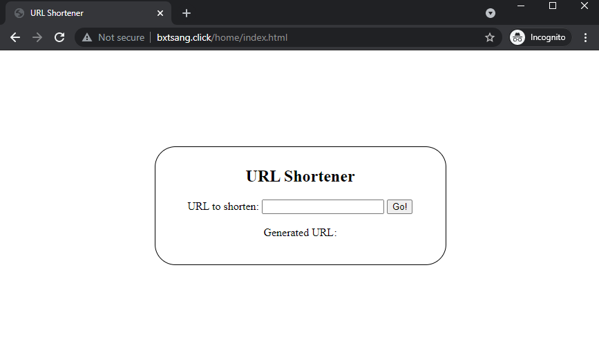

## A Simple URL Shortener

Built and deployed with AWS resources, using [Micronaut](https://micronaut.io/).

All generated urls follow the pattern *http://bxtsang.click/url/<hash>*

Go to the [deployed frontend](http://bxtsang.click/home/index.html).

## To run locally

1. Clone the repo, from the root folder (in terminal)
2. Add environment variables for `AWS_ACCESS_KEY_ID`, `AWS_SECRET_ACCESS_KEY`, `AWS_REGION` with personal AWS credentials
3. Set environment variable `MICRONAUT_ENVIRONMENTS` to "local" *(change value to "live" when deploying)*
4. run `./gradlew run`

In local mode, all generated urls follow the pattern *http://localhost:8080/url/<hash>*

## To test
1. run `./gradlew test`
2. open `/build/reports/tests/test/index.html` in browser to see full details